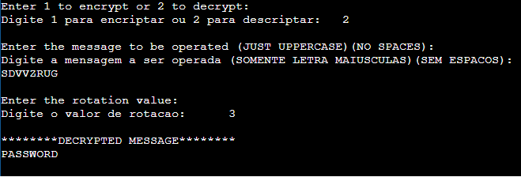

# Caesar-Cipher
Cifra de Cesar - Criptografia e Descriptografia

## Rodar no Terminal linux:
gcc main.c -o mainexec\
./mainexec

## Rodar em compilador online
onlinegdb.com

## Desafio de Segurança e Criptografia
1 - Entre na pasta "Desafio"\
2 - Abra o arquivo index.html no navegador\
3 - Tente descobrir a senha

Obs: Não é permitido olhar o arquivo script.js pois nele contêm a resposta
